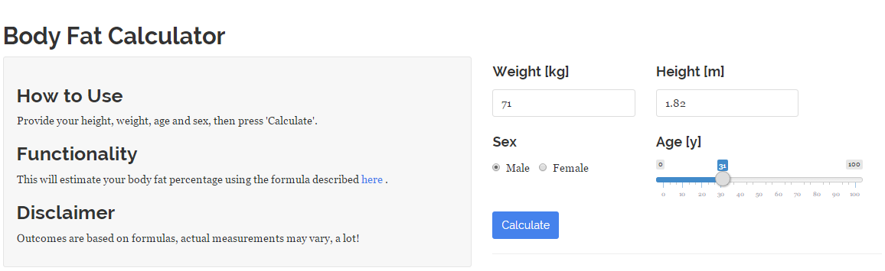
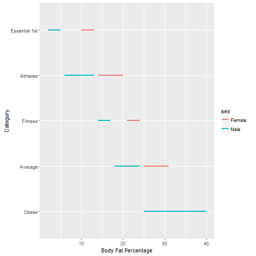

## What is the Body Fat Percentage Calculator?

- The body fat percentage calculator is an application written using Shiny and R

- It's based on a simple formula used to demonstrate the abilities of Shiny and Slidify as part of the [Developing Data Products](https://www.coursera.org/learn/data-products) Coursera course

- It will require some personal user input in order to work properly, however, it will be initialized with some example values

- It's guaranteed to protect your privacy, probably ;-)

--- .class #id 

## Why should anybody use it?

- The first step in solving a problem is knowing a problem

- According to [Shape Up America](http://shapeup.org/body-fat-and-health-risk/), there are various different health risks associated with either too low or too high levels of body fat

- Too little body fat:

    + Is linked to problems with normal, healthy functioning in both men and women.
    
    + Can lead to problems with reproduction in women.

- Too much body fat:

    + Increases the risk of many diseases, including type 2 diabetes, high blood pressure, stroke, heart disease, and certain cancers.

    + When located around the abdomen, increases the risk even further of developing the above conditions.

--- .class #id 

## User Interface

- Calculate your own body fat percentage by accessing the UI [here](https://dhunziker.shinyapps.io/Peer_Assessment_Part1/)

- The formula used requires a users weight and height for calculating the BMI

- Age, sex and the previously calculated BMI are used to estimate a users body fat percentage

--- &twocol w1:40% w2:60%

## Results

*** =left

- The [American Council on Exercise](http://www.acefitness.org/acefit/) defines the following 5 categories for the level of body fat

- There is no upper limit for Obese, I've chosen 40 for the sake of limiting the X-Axis of the plot

- Try the application now to see your results!

*** =right

